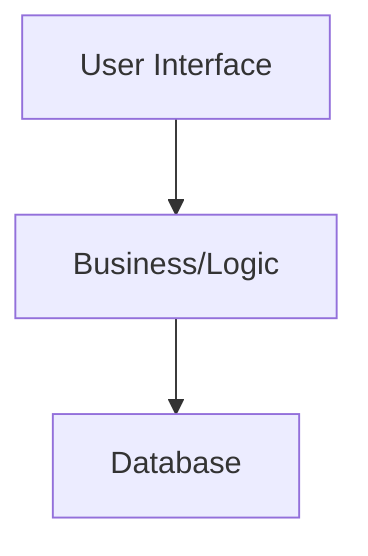

Architecture
============

The architecture of the virtual sticky notes app is a three tiered architecture
approach. The three tiers are the `User Interface`, the `Business/Logic` layer, 
and the `Database` layer. The hierarchy of these tiers is as shown below.



User Interface
--------------

Currently, we have the following UI views for the user:
- Login Page
- Account Creation Page
- List of Boards Page
- Board Page
- Sticky Note Page
- Settings

Additionally, there are other utility classes: the Pinch/Zoom/Pan class that handles movement in and
around the board view, the Popup class that handles popup dialog boxes, and Canvas Text Collapser, a
support class for Pinch/Zoom/Pan.


Logic
-----

In the Logic Layer we have seven main utility classes with three domain-specific object classes.

The three object classes are:
- `User`
    - Contains data about a User instance
- `Note`
    - Contains data about a Note instance
- `Board`
    - Contains data about a Board instance


The main business/logic classes are:
- `UserManager`
    - The `UserManager` manages creation, fetching, updating, deleting of users.
    This includes facilitating storage of the `User` objects by use of a
    `DatabaseInterface`.
- `NoteManager`
    - The `NoteManager` manages creation, fetching, updating, deleting of notes.
    This includes facilitating storage of the `Note` objects by use of a
    `DatabaseInterface`.
- `BoardManager`
    - The `BoardManager` manages creation, fetching, updating, deleting of
    boards. This includes facilitating storage of the `Manager` objects by use
    of a `DatabaseInterface`.
- `SessionManager`
    - The `SessionManager` is responsible for managing logging in and out of
    users. The `SessionManager` will assign a user an encrypted `Token` that
    will be used to facilitate the use of other utility classes.
- `DependencySelector`
	- The sole purpose of `DependencySelector` is to provide the dependency
	injection for utilizing the stub database over the persistent one. It
	is very lightweight as a result.
- `Email Utilities`
	- This class is also very lightweight and only aids the UI layer in
	verifying an incoming email address.
- `Account Utilities`
	- This class is, again, very lightweight. Its only purpose it help
	its associated UI classes with verifying password legibility,
	checking username duplication, and other account-related methods.
- `VSN State`
	- Another lightweight class, VSN State maintains a small amount of
	information regarding the current state of the program for the UI classes
	to access when performing their specific tasks.


Database
--------

The database facilitates storage of the `User`, `Board`, and `Note`.


Architecture
-------------
The following ASCII art is a representation of the current state of the architecture of the sticky
note application. Note that the `exceptions` package is not a true layer of our project, but is
rather utilized by other classes to perform their function.

```
+-----------------------------------------------------------------------------------------------------------------------------------------------------------------+
|  User Interface                                                                                                                                                 |
|                  +-----------+-----------------------------------------------------------------------------+--------------------+                               |
|                  |           |                                                                             |                    |                               |
|         +--------v-+   +-----v----+   +-----------+   +-----------+   +-------------+   +-------------+  +-+-----------+  +-----+-------+  +-------------+      |    +------------------+
|         |          |   |          |   |           |   |           |   |             |   |             |  |             |  |             |  |             |      |    | All Manager      |
|         |  Login   |   | Account  |   | List of   |   |  Board    |   | Sticky Note |   | Pinch Zoom  |  | Popup       |  | Settings    |  | Canvas Text |      |    | Classes Interact |
|         |  Page    |   | Creation |   | Boards    |   |  Page     |   | Page        |   | Pan         <--+             |  |             |  | Collapser   |      |    | With             |
|         |          |   |          |   |           |   |           |   |             |   |             |  |             |  |             |  |             |      |    |                  |
|         +-----+----+   +-+-----+--+   +------^-+--+   +------+----+   +--+----------+   +------+------+  +-------------+  +-+---^-------+  +-----+-------+      |    | +--------------+ |
|               ^          ^     |  |          | |             ^           ^                     |                            |   |                ^              |    | |  Dependency  | |
|               |          |     |  |          | |             +---------------------------------+-------------------------------------------------+              |    | |  Selector    | |
|               |          |     |  |          | |                         |                                                  |   |                               |    | +--------------+ |
|               |          |     |  |          +----------------------------------------------------------------------------------+                               |    +------------------+
|               |          |     |  |            |                         |                                                  |                                   |    | All Logic        |
+---------------+-------------------------------------------------------------------------------------------------------------------------------------------------+    | Classes Interact |
|                          |     |  |            |                         |                                                  |                                   |    | With             |
|                          |     |  +----------------------------------------------------+          +-------------------------+                                   |    |                  |
|  Logic Layer  |          |     |               |                         |             |          |                                                             |    |  +-----------+   |
|               |          |  +--+---------+     |                         |             |          |                                                             |    |  |           |   |
|            +-------------+  |            |     |                         |             |     +----+                                                             |    |  |  Note     |   |
|            v  |             |  Email     |     v                         |             |     |                                                                  |    |  |  Object   |   |
|  +---------++ |             |  Utilities | +---+-------+          +------+------+  +---v-----v----+   +---------------+                                         |    |  |           |   |
|  |          | +-----------+ |            | |           |          |             |  |              |   |               |                                         |    |  +-----------+   |
|  |  User    |             | +------------+ |  Board    |          |  Note       |  |  Account     |   | VSN State     |                                         |    |                  |
|  |  Manager |             |                |  Manager  |     +----+  Manager    |  |  Utilities   |   |               |                                         |    |  +-----------+   |
|  |          +<---------+  |                |           |     |    |             |  |              |   |               |                                         |    |  |           |   |
|  |          |          |  |                |           |     |    |             |  |              |   |               |                                         |    |  |  Board    |   |
|  +------+---+          |  |                ++--+-+-----+     |    +-+----+------+  +--------------+   +---------------+                                         |    |  |  Object   |   |
|         |              v  v                 ^  | |           |      ^    ^                         *Note: All UI classes except                                 |    |  |           |   |
|         |             ++--+--------+        |  | +------------------+    |                         Canvas Text and Account Creation                             |    |  |           |   |
|         |             |            |        |  |             |           |                         call VSN State.                                              |    |  +-----------+   |
|         |             |  Session   |        |  |             |           |                                                                                      |    |                  |
|         |             |  Manager   |        |  |             |           |                                                                                      |    |  +-----------+   |
|         +---------+   |            +<-------+  |             |           |                                                                                      |    |  |           |   |
|                   |   |            |           |             |           |                                                                                      |    |  |  User     |   |
|                   |   +------------+<------------------------------------+                                                                                      |    |  |  Object   |   |
|                   |                            |             |                                                                                                       |  |           |   |
|                   |                            |             |                                                                                                  |    |  +-----------+   |
|                  +v----------------------------v-------------v---+                                                                                              |    |                  |
+------------------+             Database Interface                +----------------------------------------------------------------------------------------------+    +------------------+
|  Database        +----------------------+--+---------------------+                                                                                              |
|                                         |  |                                                                                                                    |
|                  +----------------+     |  |     +------------------------+                                                                                     |
|                  | Mock Database  |     |  |     |  Persistent Database   |                                                                                     |
|                  +----------------+<----+  +---->+------------------------+                                                                                     |
|      *Note that the class Dependency Selector facilitates which database is chosen.                                                                             |
+-----------------------------------------------------------------------------------------------------------------------------------------------------------------+
```