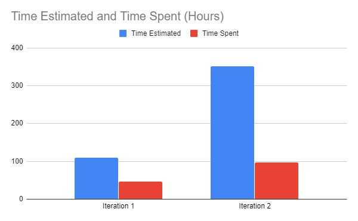

Team 11 - Final Retrospective

For three out of five of us, this was our first introduction to a team-based 
coding environment, and four out of five had never used version control 
software before. As a result, we had some technical challenges out of the gate
but these were overcome swiftly. Perhaps our largest challenge was our 
communication in general.

This manifested as two main facets: proper division of labour and the managing
of time.

The dividing of work in our group proved to be an issue in our first two
iterations. This was in part due to a lack of communication; it wasn't always
clear which group member was working on what task. This made expectations fuzzy
at best, especially for components that may have relied on others to function.
However, this also resulted due to a difficulty in predicting the dev-time
required for certain issues. Many issues took longer than anticipated to fully
finish, and some took significantly shorter amounts of time. Thus, at the start
of each iteration, it was difficult to properly divvy up work in a way that was
fair, as the time spent on an actionable item tended to vary far from the
expected value.

Time management was a larger issue for iterations one and two than it was for
our last iteration. For both of the earlier iterations, our team spent a long
work period in the library the day (and night) before the due date to ensure
everything was functional in time. This could have easily been solved if we had
started earlier on our assigned tasks, and was definitely a valuable experience
to learn from. Our third iteration was better time-wise, though still not
perfect.

As a method of improving on these fronts, properly measuring division of labour
is difficult to do, especially considering tasks that do not end up in the repo
as dev-time (such as this exact retrospective), but time management is an
easier metric to measure. Gitlab actually measures this for us in a nice
graphic under Repository -> Contributors. The top graph pretty clearly shows
rapid spikes of commits in the day or two before each deadline for the first
iterations. The third iteration, while still not quite as smooth as one would
like, is better in this regard. Commits aren't a perfect descriptor for this
measurement, as one commit can be more dev-time and code than ten others, but
it paints a well enough picture that we can see we made an improvement in this
area, even if it is a relatively small one.

Some other minor points of improvement for our team include a consistent coding
style (which could be solved with a formal coding formatting guide we each
would follow) and too wide a scope at the beginning of the project. These are
things we will definitely do for our respective next projects.

Overall, we each learned how different a group coding environment is from an
individual setting and the unique challenges it poses (such as time dedicated
to code revisions). However, version control software makes everything a
million times easier to handle, and was truly a godsend to us. Though planning
and predicting becomes harder to do as project size increases, it becomes even
more important to make sure it is done well and to stay organized while working
away. And finally, of course, it cannot be understated how good communication
can make a project like this. It is always important to check-up on people, to
make sure everyone is on the same page and working together. If anything, I
think that is our biggest takeaway from the physical experience of working on
this project.

See the velocity for the file below:
